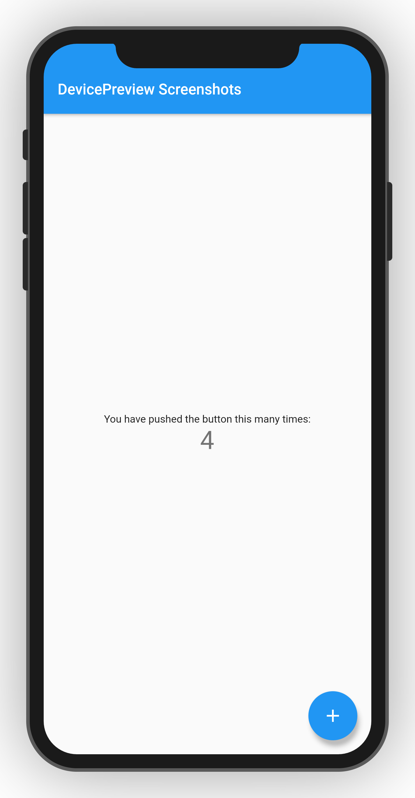
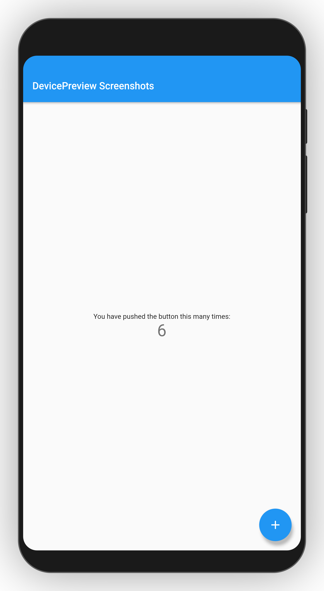
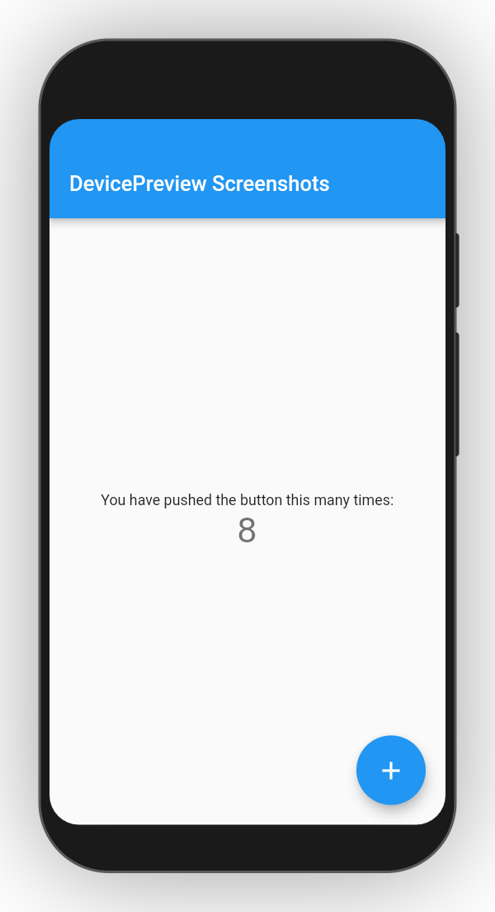

# preview_screenshot

device_preview take app screenshots offline to external storage

a small utility code to save [device_preview](https://pub.dev/packages/device_preview) screenshots 📱 on device storage easily and offline, to easily copy or move them to upload to `App Store` (google play store application screenshots).
Screenshots taken can be edited or uploaded as is to `play store`
- ❗ `supports android for now`

## demo vid


## Saved Screenshots
<table>
   <tr>
      <td> screenshot 1</td>
      <td> screenshot 2</td>
      <td> screenshpt 3</td>
   </tr>
   <tr>
      <td>
      <td>
      <td>
   </tr>
</table>

## Code snippets
### in `main.dart`
```dart
void main() {
  WidgetsFlutterBinding.ensureInitialized();
  runApp(
    DevicePreview(
      enabled: !kReleaseMode,
      onScreenshot: (screenshot) async {
        // invoked to save screenshot to user device storage
        final bytes = screenshot.bytes;
        final savedScreenshot = await savePreviewScreenshot(bytes: bytes, directory: 'DevicePreviewScreenshots');
        return savedScreenshot;
      },
      builder: (context) => MyApp(),

    ),
  );
}
```

### function implementation `savePreviewScreenshot(bytes: ..., directory: ...)`
```dart
Future<String> savePreviewScreenshot({Uint8List bytes, String directory: 'DevicePreviewScreenshots'}) async {
  final bool _permissionStorage = await hasConfirmedStoragePermission();

  if (_permissionStorage) {
    final extDirectory = await ExtStorage.getExternalStorageDirectory();
    final dirName    = await Directory('$extDirectory/$directory').create(recursive: true);
    final fname     = 'screenshot-${DateTime.now().toIso8601String()}.png';
    final fileP     = '${dirName.path}/$fname';

    final File file = File(fileP);

    final _result = await file.writeAsBytes(bytes, mode: FileMode.writeOnly);

    return _result.path;
  }

  else {
    await askStoragePermission();
    return '';
  }
}
```

## Plugins
- [device_preview](https://pub.dev/packages/device_preview) preview your app on different devices, [test responsiveness](https://github.com/flutterdevzim/responsive-architecture)
- [permission_handler](https://pub.dev/packages/permission_handler) request permission to storage
- [ext_storage](https://pub.dev/packages/ext_storage) get access to device external | internal accessible storage `ANDROID ONLY` 

## Getting Started

This project is a starting point for a Flutter application.

A few resources to get you started if this is your first Flutter project:

- [Lab: Write your first Flutter app](https://flutter.dev/docs/get-started/codelab)
- [Cookbook: Useful Flutter samples](https://flutter.dev/docs/cookbook)

For help getting started with Flutter, view our
[online documentation](https://flutter.dev/docs), which offers tutorials,
samples, guidance on mobile development, and a full API reference.
